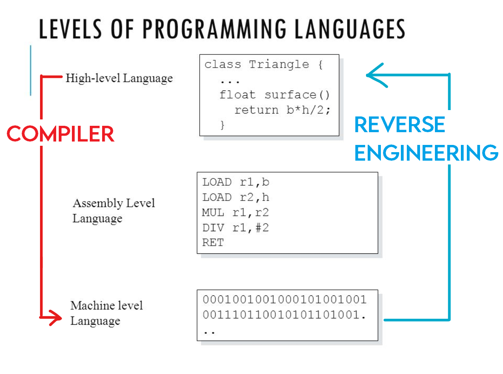
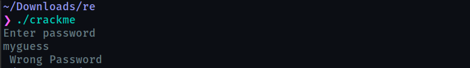
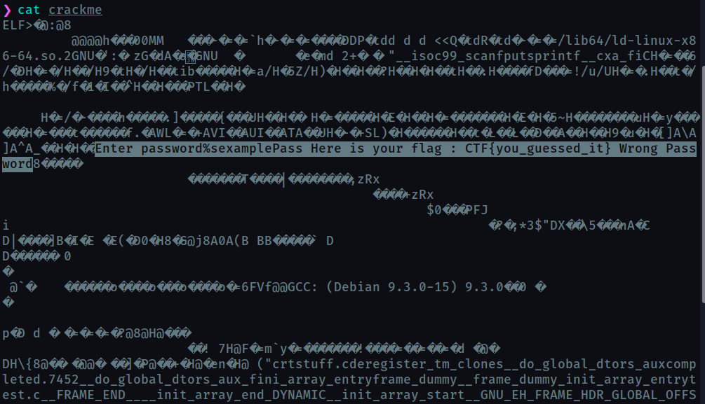
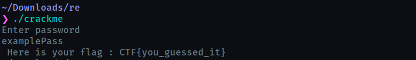

# Intro to CTFs

#### + other things you should know

---

## CTF

* Capture The Flag
* Special kind of information security competitions
* Use [ctftime.org](https://ctftime.org) to track CTFs and your team’s performance

----

### Flag

* A secret string
* Can be found only when you successfully solve the challenge
* Thus, submitted as a proof of completion
* Usually of a format like `xyzCTF{}`
* In pentesting and some CTF variants, the flag can be found in a file
* Accessible only when you break in and gain access

---

## Variants

* Jeopardy
* Attack-Defence
* KOTH
* Hardware

----

### Jeopardy

* Challenges from various categories
* Most famous
* Find the flag and submit it for points
* Sometimes, dynamic scoring -> more solves, less points
* Extra points for the first solve - `First Blood`

----

### Attack-Defence

* Each team will be given a vulnerable service
* Teams will defend their own service and patch it up
* Simultaneously, attack the other teams' services and develop exploits
* DEFCON and NYU-CSAW Finals - must-watch

----

### KOTH

* King Of The Hill
* Asbolute chaos and fun
* Multiple teams
* Single target network consisting of many inter-connected systems
* Repeatedly pivot and gain access to systems
* Defend them from other teams
* TryHackMe and HackTheBox

----

### Hardware

* Black box testing
* Break built-in security measures

---

## Categories

* Web Exploitation
* Reverse Engineering
	* Binary Exploitation
* Forensics
	* Steganography
* Cryptography
* OSINT
* Programming

---

### Web Exploitation

* Deals with web applications
* Identify flaws in the working of the web app
	* how it processes user input
	* programming flaw
* Knowledge of web development will be helpful
	* at least, you require the ability to read and understand JS and PHP code
* [OWASP Top10](https://owasp.org/www-project-top-ten/)

----

### Challenge #1

* Text box that receives input of name of person
* Outputs the details of that person
* Incomplete or invalid queries err out silently

----

#### HINT1

SQL query in the backend might be something similar to

```SQL
SELECT * FROM accounts WHERE name="$INPUT_NAME";
```

----

#### HINT2

Think about logical operators

```SQL
SELECT * FROM accounts WHERE name="$INPUT_NAME";
```

----

#### HINT3

* `//` in C++
* `#` in Python

```SQL
SELECT * FROM accounts WHERE name="$INPUT_NAME";
```

----

### Solution

* The SQL query can be broken by introducing comment characters in the input like

```SQL
SELECT * FROM account WHERE name="xyz" OR 1=1#";
```

---

### Reverse Engineering

- In simple terms Reverse Engineering refers to the process of deconstructing any engineered object to figure out the internal mechanisms.

- Reverse Engineering in a CTF is typically the process of taking a compiled program ( like apk, exe, elf ) and converting it back into a more human readable format.

- The goal of a reverse engineering challenge is to understand the functionality of a given program such that you can identify deeper issues.

----



----

## Example


----


----



----



----


----



----

### Books and Tutorials

- Hacking, The Art Of Exploitation
- [LiveOverflow](https://www.youtube.com/watch?v=iyAyN3GFM7A&list=PLhixgUqwRTjxglIswKp9mpkfPNfHkzyeN)
- [A Crash Course in x86 Assembly for Reverse Engineers](https://sensepost.com/blogstatic/2014/01/SensePost_crash_course_in_x86_assembly-.pdf)


### Labs

- [Crackmes](https://crackmes.one/)

----

### Tools

- [GDB](https://www.gnu.org/software/gdb/)
- [Ghidra](https://ghidra-sre.org/)
- [radare2](https://www.radare.org/)
- [IDA Pro](https://hex-rays.com/ida-pro/)
- [More](https://github.com/apsdehal/aWEsoMe-cTf#reversing)

---

### Forensics

* abc

---

### Cryptography

* Cryptic message with a hint in the challenge description or title
* Deeper concepts require a good knowledge of mathematics

----

### Challenge #4

* Caesar cipher
* Base64

----

### Solution

---

### OSINT

* Open Source INTelligence
	* Anything that is available to everybody in the internet
* If you know how to search smartly, the challenge is already over
* Google Dorks is your excalibur

----

### Challenge #5

* Find my roll number

----

### Solution

Google query:

```
<name> <roll_num_format> site:<college website>
```

---

### Programming

* Programming challenge
* Usually automation related or simple problem-solving
* **Python** is high-level general purpose programming language
	* Huge library and community
* Used in all places, right from RE to WE

----

### Challenge #6

* You are presented with a quiz website
* 1000Q, single right answer
* Wrong answer resets your score BUT
* Also provides with the right answer

----

### Solution

* Automated web-scraping
* Enter a random answer and collect all the right answers with their questions
* This time, get the question, find its answer and enter it

---

## Practice sites

* [TryHackMe](https://tryhackme.com)
* [VulnHub](https://www.vulnhub.com/)
* [HackTheBox](https://hackthebox.eu)

---

**Don't be a script kiddie**


---

## Writeups

* Make sure to record your approaches
* Preferably in markdown, because
	* Plain text -> easily transferrable
	* No need to install another application
	* Your favourite text editor will do
* Will benefit others as well

---

## Blog

If you dislike any or all of the following

* front-end web development
* writing HTML code and content
* styling with CSS
* creating your webpage from scratch

then, **Jekyll** is your friend

----

* Write content in markdown and Jekyll will generate the HTML for it
* **GitHub pages** offers free and easy hosting solution for static websites
