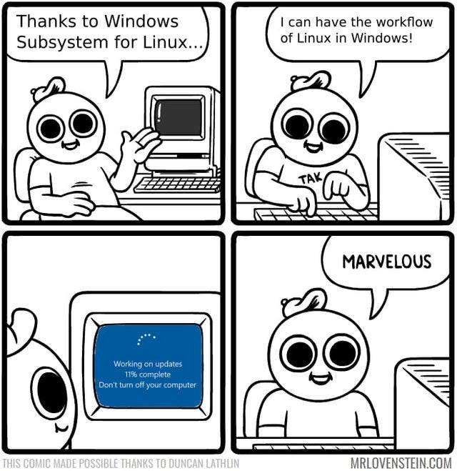
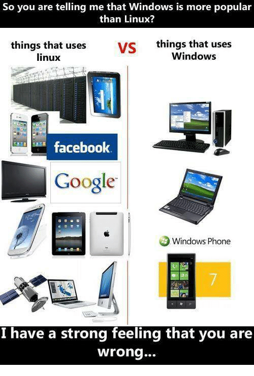
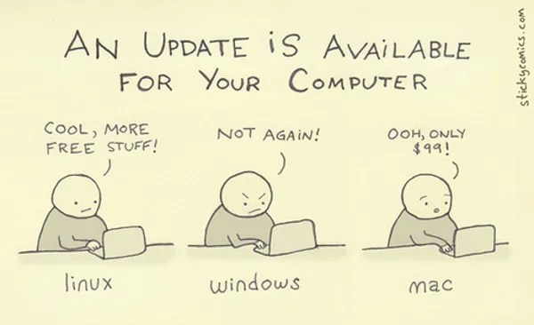
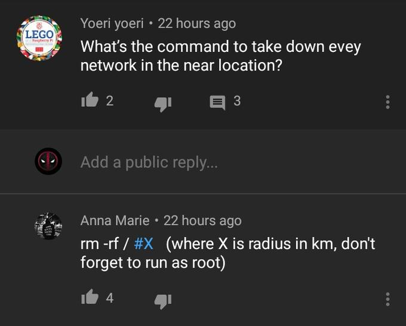
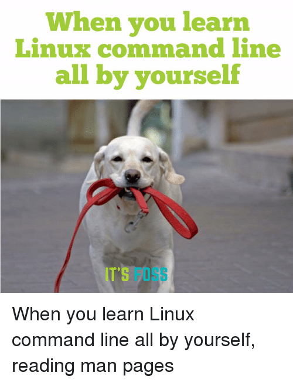

# Intro to Linux

#### *Oh I use Arch BTW*
---

# What is OS ?
----
### An operating system is a program that acts as an interface between the user and the computer hardware and controls the execution of all kinds of programs.
----

---

# What is Linux ? 
----
## Just like Windows, iOS, and Mac OS, Linux is an operating system.
----
* ### Linux began in 1991 as a personal project by Finnish student Linus Torvalds.
* ### It is one of the most popular platforms on the planet.
* ### Even Android, is powered by the Linux operating system.
----
## Different pieces of Linux
* #### Bootloader
* #### Kernel
* #### Init system
* #### Daemons
* #### Graphical server
* #### Desktop environment
* #### Applications
---

# Windows vs Linux 
# & 
# Why Linux ? 
----

|  Windows                                     |         Linux                   |
| :--------:                                   | :--------:                      |
|  Windows has different drives like C: D: E   |  There are no drives in Linux   |
| pay to use                                   | Free and open source            |
| Reboot  the system for just about everything |  your OS will not bother you    |
| Lots of games for windows                    | Linux is not for gaming (as for now) |
| Limited and unstable pen-testing tools       | Lots of pentesting tools        |
----

----
## Why Linux ? 
- Linux is a free and open-source software development and distribution.
- you can run Linux on any computer  from a low-cost PC to a supercomputer
- Don’t Freeze Up Or Slows Down Due To Memory Leaks
-  Linux is the most secure OS as it has very fewer vulnerabilities. 
- Linux distros support all the Unix software packages
----

---

## Different Distros of Linux 

* #### Linux has a number of different versions for every type of user.
* #### These versions are called distributions ( "distros" in short )
----
### Popular Linux distros : 
* #### [UBUNTU](https://ubuntu.com/)
* #### [KALI LINUX](kali.org)
* #### [DEBIAN](https://www.debian.org/)
* #### [LINUX MINT](https://linuxmint.com/)
* #### [FEDORA](https://getfedora.org/)
* #### [PARROT OS](https://www.parrotsec.org/)
* #### [ARCH LINUX](https://archlinux.org/)
* #### [Ubuntu Server](https://ubuntu.com/download/server)
###### [and many more....](https://distrowatch.com/)
----
## Installation 
* ### Install as the main OS
* ### Using VirtualBox/VMware
* ### Dual Boot
----

----
##### comming soon ....
---

## File structure of Linux

##### The Linux File Hierarchy Structure or the Filesystem Hierarchy Standard (FHS) defines the directory structure and directory contents in Unix-like operating systems.
----
## `/` [/root]
#### root directory of the entire file system hierarchy
----

----
*  `/bin` -->  Contains binary executables
*  `/boot` --> Contains Boot loader files, e.g., kernels, initrd. 
* `/dev` --> Essential device files
* `/etc` --> Contains configuration files required by all programs.
----
* `/home` --> Users’ home directories, containing saved files, personal settings, etc.
* `/lib` --> Libraries essential for the binaries in /bin/ and /sbin/.
*  `/media` --> Temporary mount directory for removable devices.
----
* ####  `/opt` --> Contains add-on applications from individual vendors
* #### `/tmp` --> Directory that contains temporary files created by system and users.
* #### `/usr` --> Contains binaries, libraries, documentation, and source-code for second level programs.
---

# Basic commands 
* ### The Linux command is a utility of the Linux operating system.
* ### The commands are executed on the Linux terminal.
* ### We can do basic work and advanced work through its terminal.
----
* #### `pwd` -> Shows Present working directory
* #### `mkdir <new_directory>` -> Make new directory
* #### `rmdir <dir_name>` -> Remove a directory
* #### `ls` -> Shows list of content of a directory
* #### `cd <dir_name>` -> Change directory
----
* #### `touch <file_name>` -> Create new Empty file
* #### `cat` -> Create/display/copy file
* #### `rm <file_name>` -> Remove a file
* #### `cp` -> copy a file or directory
* #### `head` & `tail` -> displays first and last 10 lines of a file respectively
* #### `tac` -> shows file content in reverse order
----

----
* #### `su` -> Gives admin access to a user
* #### `useradd <username>` -> add or remove a user
* #### `passwd <username>` -> create or change the passowrd for a user
* #### `groupadd` -> create a user group
* #### `whoami` & `who` -> gives info abhout logged in user
----
* #### `grep <options>` -> Used for searching the content from a file using regex.
* #### `comm <options>` -> compares two files
* #### `wc <file_name>` -> counts words,lines and charecters in a line.
* #### `od <options>` -> displays the content of a file in different format.
* #### `find <options>` -> find particular file in a directory
----
* #### `df` -> Displays disk space used in file system.
* #### `clear` -> Clears the terminal's screen.
* #### `ifconfig` -> Shows ip of connected networks
* #### `ssh` -> Used to create a remote connection through ssh protocol
* #### `host` -> Displays id of a given domain name or vice versa
----
* `man` -> Displays manual page for any command

----

---

# Some common tools 
#### Pre-installed app varries from distros to distro. But we can download and install maximum of apps in any distro , though installation process may verry.
----
### Networking tools 
- [Nmap](https://github.com/nmap/nmap)
- [Wireshark](https://github.com/wireshark/wireshark)
- [NetworkMinner](https://www.netresec.com/?page=NetworkMiner)

----
### Web tools
- [Burpsuite (& plugins)](https://portswigger.net/burp)
- [ZAP](https://github.com/zaproxy/zaproxy)
- [Gobuster](https://github.com/OJ/gobuster)
- [Nikto](https://github.com/sullo/nikto)
----
### Criptography Tools

- [HashID](https://github.com/psypanda/hashID)
- [John The Ripper](https://github.com/openwall/john)
- [Hashcat](https://github.com/hashcat/hashcat)
- [CyberChef](https://gchq.github.io/CyberChef/)
- [dCode](https://www.dcode.fr/en)
- [Ciphey](https://github.com/Ciphey/Ciphey)
----
### Reversing Tools

- [GDB](https://www.gnu.org/software/gdb/)
- [Ghidra](https://ghidra-sre.org/)
- [radare2](https://www.radare.org/)
- [IDA Pro](https://hex-rays.com/ida-pro/)
- [More](https://github.com/apsdehal/aWEsoMe-cTf#reversing)

---

### Thank you

