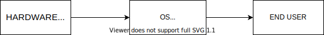
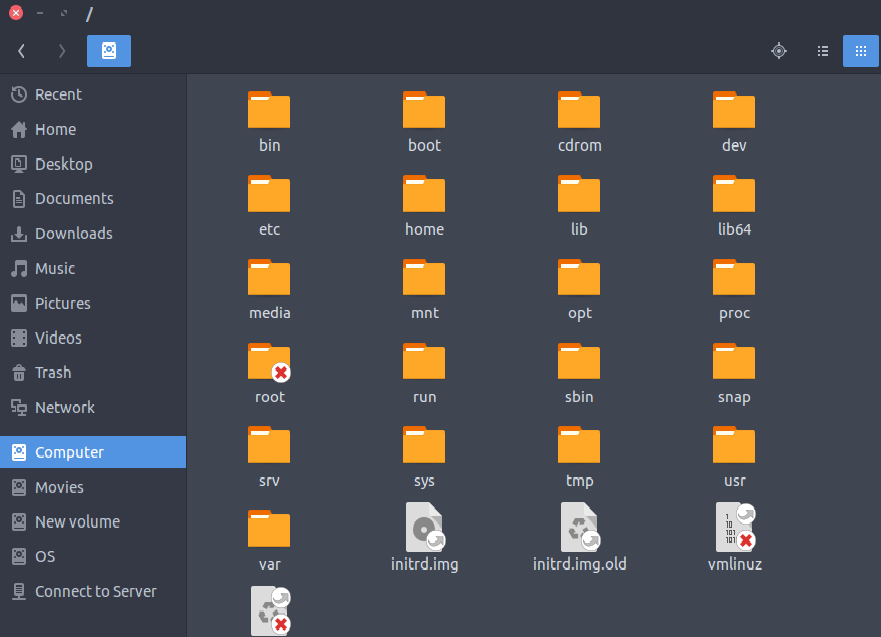

# Intro to Linux

#### *Oh I use Arch BTW*
---

# What is OS ?
----
### An operating system is a program that acts as an interface between the user and the computer hardware and controls the execution of all kinds of programs.
----

---

# What is Linux ? 
----
## Just like Windows, iOS, and Mac OS, Linux is an operating system.
----
* ### Linux began in 1991 as a personal project by Finnish student Linus Torvalds.
* ### It is one of the most popular platforms on the planet.
* ### Even Android, is powered by the Linux operating system.
----
## Different pieces of Linux
* #### Bootloader
* #### Kernel
* #### Init system
* #### Daemons
* #### Graphical server
* #### Desktop environment
* #### Applications
---

# Windows vs Linux & Why Linux ? 
----
----
---

# Different Distros of Linux 

* ### Linux has a number of different versions for every type of user.
* ### These versions are called distributions ( "distros" in short )
----
## Popular Linux distros : 
* ### UBUNTU
* ### KALI LINUX
* ### DEBIAN
* ### LINUX MINT
* ### FEDORA
* ### PARROT OS
* ### ARCH LINUX
* ### Ubuntu Server
##### and many more....
----
## Installation 
* ### Install as the main OS
* ### Using VirtualBox/VMware
* ### Dual Boot
----
##### comming soon ....
---

# File structure of Linux

#### The Linux File Hierarchy Structure or the Filesystem Hierarchy Standard (FHS) defines the directory structure and directory contents in Unix-like operating systems.
----
## `/` [/root]
#### root directory of the entire file system hierarchy
----

----
* ## `/bin` -->  Contains binary executables
* ## `/boot` --> Contains Boot loader files, e.g., kernels, initrd. 
* ## `/dev` --> Essential device files
* ## `/etc` --> Contains configuration files required by all programs.
* ## `/home` --> Users’ home directories, containing saved files, personal settings, etc.
* ## `/lib` --> Libraries essential for the binaries in /bin/ and /sbin/.
* ##  `/media` --> Temporary mount directory for removable devices.
* ##  `/opt` --> Contains add-on applications from individual vendors
* ## `/tmp` --> Directory that contains temporary files created by system and users.
* ## `/usr` --> Contains binaries, libraries, documentation, and source-code for second level programs.
---

# Basic commands 
* ### The Linux command is a utility of the Linux operating system.
* ### The commands are executed on the Linux terminal.
* ### We can do basic work and advanced work through its terminal.
----
* ## `pwd` -> Shows Present working directory
* ## `mkdir <new_directory>` -> Make new directory
* ## `rmdir <dir_name>` -> Remove a directory
* ## `ls` -> Shows list of content of a directory
* ## `cd <dir_name>` -> Change directory
* ## `touch <file_name>` -> Create new Empty file
* ## `cat` -> Create/display/copy file
* ## `rm <file_name>` -> Remove a file
* ## `cp` -> copy a file or directory
* ## `head` & `tail` -> displays first and last 10 lines of a file respectively
* ## `tac` -> shows file content in reverse order
----
* ## `su` -> Gives admin access to a user
* ## `useradd <username>` -> add or remove a user
* ## `passwd <username>` -> create or change the passowrd for a user
* ## `groupadd` -> create a user group
* ## `whoami` & `who` -> gives info abhout logged in user
----
* ## `grep <options>` -> Used for searching the content from a file using regex.
* ## `comm <options>` -> compares two files
* ## `wc <file_name>` -> counts words,lines and charecters in a line.
* ## `od <options>` -> displays the content of a file in different format.
* ## `find <options>` -> find particular file in a directory
---
* ## `df` -> displays disk space used in file system.
* ## `clear` -> clears the terminal's screen.
* ## `ifconfig` -> Shows ip of connected networks
* ## `ssh` -> used to create a remote connection through ssh protocol
* ## `host` -> displays id of a given domain name or vice versa
##### and many more ...

---
# Some common tools 

---
# Do and Donts 
---
